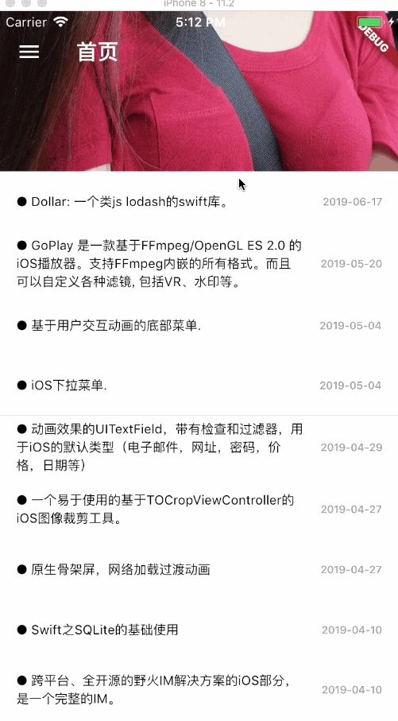

# flutter_gank

一个基于flutter+dart所写的干货集中营客户端,

## 截图

## 第三方依赖插件
* flutter_staggered_grid_view,一款瀑布流gridView,还不错,没什么问题存在,唯一缺点:不能根据图片大小布局
* webview_flutter,浏览器插件
* photo_view,一个可以让Image手势缩放的组件,起码比其他类似组件都好很多
* sqflite,数据库插件,相当于Android的Sqlite
* shared_preferences,就是Android中的sharedPreferences
* share,分享应用给第三方App插件
* path_provider,我也不太清楚这个插件的作用,我就用这个来寻找App文件夹存放的位置
* flutter_colorpicker,颜色选择器组件
* http,加载网络的库,方便
* pull_to_refresh(我自己的库),上拉下拉组件,实测效果挺不错,虽然并没有实现像SmartRefreshLayout这种库这么多的功能,不过我觉得应该是差不多了,毕竟是用flutter写的有点困难。(效果图在图1)
* residemenu(我自己的库),这个不用说都知道什么了,侧滑菜单嘛,炫酷一点

## 实现的功能

 - [x] 下拉刷新捕获新的数据和上拉数据加载以前的数据
 - [x] 图片半瀑布流
 - [x] 可以基于关键字搜索干货
 - [x] 图片可以点击后放大,双击放大缩小,双指缩放
 - [x] 数据库保存信息的功能,节省用户加载流量
 - [x] 收藏干货和妹子图功能
 - [x] 拖动list item到外面取消收藏的功能
 - [x] 夜间模式,自由改变主题颜色
 - [ ] 反馈
 - [x] 双击退出程序
 
 ## 未来可能想实现的功能
 * 在妹子界面里,其实可以搞得有点创意,比如利用我自己的刷新库打开二楼玩探探收藏之类的,代替那个卡片的形式，可能会更好,但是目前来说,
 没有什么好的组件能实现探探之类的效果,也不想自己去写一个。

## 一些已经解决的问题
* 夜间模式,改变主题颜色,这类功能要不断依赖某个全局状态,没有redux的话要怎么弄?flutter提供了一个MaterialApp的东西让我们去保存一些主题和颜色在里面,我们可以利用这个,通过Theme.of(context)....来获取全局的颜色,
那如果在子组件点击后改变了状态,那我们要怎么告诉App要改变那个状态并刷新?1.不断传递回调方法给子组件,2.编写一个of()的方法,类似Scaffold.of(context)来取得App对象,不过要确保App是一个单例对象。
* sqflite这个插件遇到一个坑爹问题,好像是说我的数据库被锁定的问题,这个问题是因为我数据库被多次打开时产生的异常,解决方法:1.在spalshActivity打开数据库,让数据库保持打开状态,2.用双重检查锁来判断数据是否被打开吧,虽然我也不知道怎么弄
* BottomNavigationBar背景颜色问题?无论是fixedColor还是item的backgroundColor都没法改,这应该是个Bug,通过改App里的canvasColor来实现改变背景颜色
* Text在Row孩子节点时没办法换行的问题?通过Flexible来包装吧...

## 无法解决的问题
* ResideMenu存在一个性能上的问题,如果我不采用Scale动画内容View性能不会严重下滑,但不用Scale,那还叫什么ResideMenu,是吧?影响性能问题是因为Gpu在滑动的时候受到影响,只要内容View里要渲染的东西多了,性能就会
下滑,假如没放ListView那些根本就不存在性能问题。这个问题我真不知道怎么解决,官方是说RepaintBoundary可以帮助我,但我也没弄清楚那个东西是干什么的,试了然后没有任何作用,最后只能放弃了,无解。
* 真机测试黑屏问题,这个问题我猜应该和skia引擎拖不了干系吧,在模拟器完全没有黑屏的问题,但是我真机测试就有这个问题,开App支持不了两分钟,只要内存差不多顶峰时,就黑屏奔溃...2019更新:这个问题感觉已经被flutter修复了
* 关于压缩图片的问题,首先为什么要压缩图片?如果不压缩,其中影响的第一个就是内存占用,第二就是性能,你图片大了,加载时间就会长,所以会卡顿,这个问题也是烦,flutter并没有提供压缩图片的功能,我已经尝试用过使用image这个三方库来压缩,压缩是没有什么问题,但是压缩消耗的时间太长了,用isolate这个库来实现Java的多线程处理,不会用...

## 感谢
@代码家 提供的免费API
